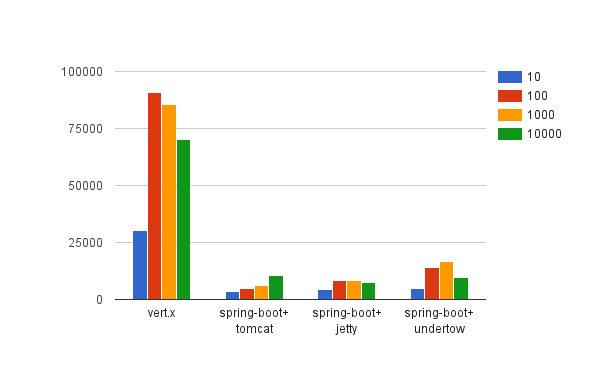

Java performance: threads vs non-blocking I/O

# Servers

  
# Server configuration

## `/etc/security/limits.conf` 

I added following lines to `/etc/security/limits.conf` 

    * soft nofile 100000
    * hard nofile 100000
    * soft nproc 100000
    * hard nproc 100000

## `/etc/sysctl.conf` 

Added following lines on `/etc/sysctl.conf` 

    net.ipv4.ip_local_port_range = 18000    65535
    net.ipv4.tcp_tw_reuse = 1

Note: default value is following:

    # sysctl net.ipv4.ip_local_port_range
    net.ipv4.ip_local_port_range = 32768        60999
    # sysctl net.ipv4.tcp_tw_reuse
    net.ipv4.tcp_tw_reuse = 0

## Other configuration values

On Baremetal

    root@client1:~# cat /proc/sys/fs/file-max
    812123
    root@client1:~# cat /proc/sys/kernel/threads-max
    63451

On VPS

    root@vs:~# cat /proc/sys/fs/file-max
    403702
    root@vs:~# cat /proc/sys/kernel/threads-max
    31543

# Benchmarking method

I used `wrk` for benchmarking.

## Warming up

I ran `wrk --latency -t 4 -c 10 -d 10s http://10.1.65.237:8080/` before  running benchmark.

## Result

### Baremetal server

#### Server spec

2 scaleway’s baremetal instances for client and server.

    4 Dedicated x86 64bit Cores
    8GB Memory
    50GB SSD Disk
    
    1 Flexible public IPv4
    300Mbit/s Internet bandwidth
    2.5Gbit/s Internal bandwidth

### Score

See result/ for raw data.

### VPS

#### Default configuration

    root@vsl:~# sysctl net.ipv4.ip_local_port_range
    net.ipv4.ip_local_port_range = 32768	60999
    root@vsl:~# sysctl net.ipv4.tcp_tw_reuse
    net.ipv4.tcp_tw_reuse = 0
    root@vsl:~# cat /proc/sys/fs/file-max
    815928
    root@vsl:~# cat /proc/sys/kernel/threads-max
    63748

